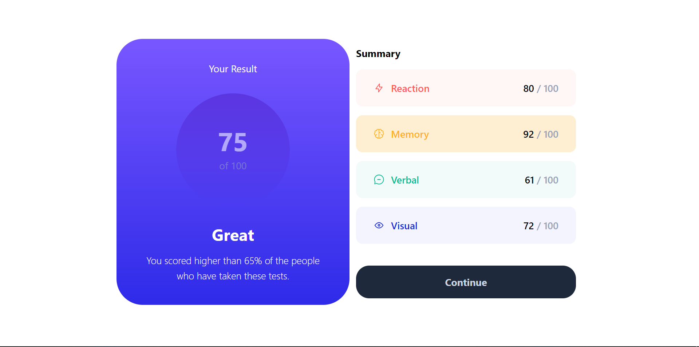

# Frontend Mentor - Results summary component solution

This is a solution to the [Results summary component challenge on Frontend Mentor](https://www.frontendmentor.io/challenges/results-summary-component-CE_K6s0maV).

## Table of contents

- [Overview](#overview)
  - [The challenge](#the-challenge)
  - [Screenshot](#screenshot)
  - [Links](#links)
- [My process](#my-process)
  - [Built with](#built-with)
- [Author](#author)

## Overview

### The challenge

Users should be able to:
- Rebuild the component using the PNG image
- View the optimal layout for the interface depending on their device's screen size
- See hover and focus states for all interactive elements on the page

### Screenshot

### Links

- Solution URL: [Github](https://github.com/Ebimo21/result-summary-component.git)
- Live Site URL: [Vercel](https://result-summary-component-app.vercel.app/)

## My process

### Built with

- Vite Framework
- TailwindCSS
- Flexbox
- Mobile-first workflow
- [Vite](https://vitejs.dev/) - JS library
- [TailwindCSS](https://tailwindcss.com/) - For css styling

## Author

- Ebimobowei Pondei
- Frontend Mentor - [@ebimo21](https://www.frontendmentor.io/profile/ebimo21)
- Twitter - [@ebimopondei](https://www.twitter.com/ebimopondei)